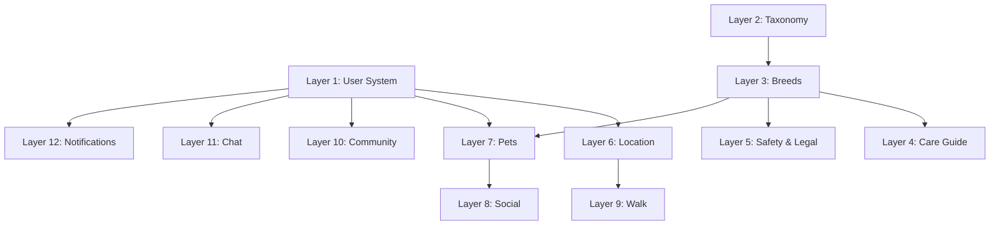
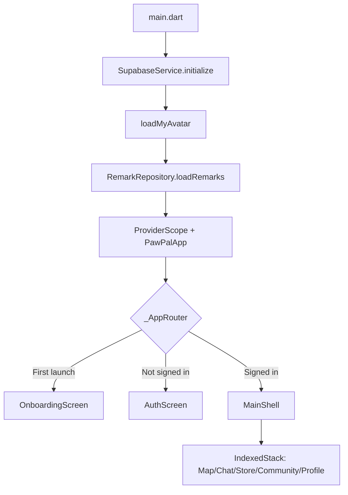
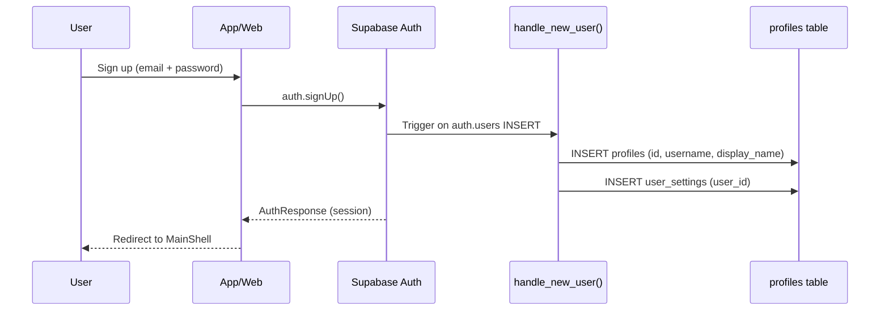

# PawPal Ecosystem — Developer Guide v1.0

> **Last Updated**: 2026-04-08  
> **Maintainer**: PawPal Engineering  
> **Status**: Production (v1.0.0)

---

## Table of Contents

1. [Project Overview](#1-project-overview)
2. [Repository Structure](#2-repository-structure)
3. [Technology Stack](#3-technology-stack)
4. [Architecture Principles](#4-architecture-principles)
5. [Database (Supabase/PostgreSQL)](#5-database-supabasepostgresql)
6. [Flutter Mobile App](#6-flutter-mobile-app)
7. [Next.js Website](#7-nextjs-website)
8. [Cross-Platform Data Contract](#8-cross-platform-data-contract)
9. [Authentication & Authorization](#9-authentication--authorization)
10. [Error Handling & Observability](#10-error-handling--observability)
11. [Internationalization (i18n)](#11-internationalization-i18n)
12. [Security Policy](#12-security-policy)
13. [Testing Strategy](#13-testing-strategy)
14. [Deployment & CI/CD](#14-deployment--cicd)
15. [Extensibility Patterns](#15-extensibility-patterns)
16. [Migration Guide](#16-migration-guide)
17. [Known Issues & Technical Debt](#17-known-issues--technical-debt)
18. [Glossary](#18-glossary)

---

## 1. Project Overview

PawPal is a **cross-platform pet community ecosystem** comprising:

| Platform | Technology | Purpose |
|----------|-----------|---------|
| **Mobile App** | Flutter (Dart) | Full-featured client: map, chat, pet management, NFC, AI recognition |
| **Website** | Next.js 16 (React 19) | Marketing, Globe visualization, NFC tag lookup, Store, user profiles |
| **Backend** | Supabase (PostgreSQL 15 + PostGIS) | Auth, database, storage, realtime, RPC functions |
| **AI Services** | Google Gemini 1.5 Flash | Intent extraction, breed recognition, multilingual search |

### Core Features
- 📍 Interactive map with pet-related POIs (vets, parks, shelters)
- 🐾 Pet profiles with NFC tag enrollment
- 🗺️ Walk tracking with route recording
- 💬 Real-time chat (1:1, groups, friend requests)
- 🌍 Community posts & quest system
- 🛒 Pet store with Stripe payment
- 🤖 AI-powered breed recognition & smart search
- 🌐 3D Globe visualization with live pet data

---

## 2. Repository Structure

```
PAWPAL/
├── Pawpal_Git/                    # Flutter mobile app
│   ├── lib/
│   │   ├── main.dart              # Entry point
│   │   ├── app.dart               # MaterialApp + theme + routing
│   │   ├── core/                  # Shared infrastructure
│   │   │   ├── constants.dart     # API keys & endpoints
│   │   │   ├── models/            # Domain models (PetModel, UserProfile)
│   │   │   ├── providers/         # Riverpod state providers
│   │   │   ├── services/          # Business logic services
│   │   │   ├── theme/             # Theme tokens & extensions
│   │   │   └── widgets/           # Shared UI components
│   │   ├── features/              # Feature modules (vertical slices)
│   │   │   ├── auth/              # Login, registration, social auth
│   │   │   ├── chat/              # Messaging (1:1, groups, search)
│   │   │   ├── community/         # Posts, comments, reactions
│   │   │   ├── feed/              # Activity feed
│   │   │   ├── home/              # Map view + AI search bar
│   │   │   ├── notifications/     # Push & in-app notifications
│   │   │   ├── onboarding/        # First-launch onboarding flow
│   │   │   ├── pet/               # Pet CRUD + breed selection
│   │   │   ├── post/              # Post/Quest creation
│   │   │   ├── profile/           # User profile + NFC management
│   │   │   ├── recognize/         # AI breed recognition camera
│   │   │   ├── settings/          # App settings
│   │   │   ├── store/             # E-commerce (Stripe)
│   │   │   └── walk/              # Walk tracking + history
│   │   ├── l10n/                  # Localization (ARB files)
│   │   └── main_shell.dart        # Bottom navigation shell
│   ├── supabase/
│   │   └── migrations/            # SQL migrations (001–024)
│   └── pubspec.yaml               # Flutter dependencies
│
└── pawpal website/                # Next.js website
    ├── src/
    │   ├── app/                   # App Router pages
    │   │   ├── page.tsx           # Homepage (Server Component)
    │   │   ├── layout.tsx         # Root layout
    │   │   ├── globals.css        # Global styles
    │   │   ├── about/             # About page
    │   │   ├── api/               # API routes (search)
    │   │   ├── auth/              # Auth callback
    │   │   ├── globe/             # Full-page 3D Globe
    │   │   ├── profile/           # Public user profiles
    │   │   ├── store/             # E-commerce store
    │   │   └── tag/[id]/          # NFC tag public lookup
    │   ├── components/            # React components
    │   │   ├── AuthProvider.tsx    # Supabase auth context
    │   │   ├── Globe*.tsx         # 3D Globe components
    │   │   ├── HomeClientParts.tsx # Client-side homepage interactivity
    │   │   ├── Navbar.tsx         # Navigation bar
    │   │   └── Footer.tsx         # Site footer
    │   ├── lib/                   # Server utilities
    │   │   ├── supabase.ts        # Client-side Supabase client
    │   │   ├── supabaseServer.ts  # Server-side Supabase client
    │   │   ├── fetchPlaces.ts     # Places data fetcher
    │   │   └── fetchQuests.ts     # Quests data fetcher
    │   └── types/                 # TypeScript type definitions
    ├── package.json
    └── .env.local                 # Environment variables
```

---

## 3. Technology Stack

### Mobile App
| Layer | Technology | Version |
|-------|-----------|---------|
| Framework | Flutter | 3.41.x |
| Language | Dart | 3.11+ |
| State Management | **Riverpod** | 2.6.x |
| Backend SDK | supabase_flutter | 2.8.x |
| Maps | flutter_map + Mapbox | 8.2.x |
| NFC | nfc_manager | 3.5.x |
| AI | google_generative_ai | 0.4.x |
| Payments | Stripe (via WebView) | — |
| Fonts | Google Fonts (Noto Sans SC) | 6.2.x |

### Website
| Layer | Technology | Version |
|-------|-----------|---------|
| Framework | Next.js (App Router) | 16.1.x |
| Language | TypeScript | 5.x |
| React | React | 19.2.x |
| Styling | Tailwind CSS | 4.x |
| Animation | Framer Motion | 12.x |
| 3D Globe | react-globe.gl + Three.js | 2.37.x |
| Backend SDK | @supabase/supabase-js | 2.101.x |
| Payments | Stripe | 21.x |
| Maps | MapLibre GL | 5.20.x |

### Backend (Supabase)
| Component | Technology |
|-----------|-----------|
| Database | PostgreSQL 15 + PostGIS |
| Auth | Supabase Auth (email, Google, Apple) |
| Storage | Supabase Storage (avatars, pet media) |
| Realtime | Supabase Realtime (post updates) |
| Functions | PostgreSQL RPC (nearby_places, counters) |

---

## 4. Architecture Principles

### 4.1 Feature-First Vertical Slices (Flutter)

The Flutter app uses a **feature-first architecture** where each feature module is self-contained:

```
features/
└── chat/                        # Feature module
    ├── chat_list_screen.dart     # UI screens
    ├── chat_detail_screen.dart
    ├── unified_search_screen.dart
    ├── models/                   # Feature-specific models
    │   ├── conversation.dart
    │   └── mock_chat_data.dart
    ├── repositories/             # Data access layer
    │   ├── chat_repository.dart
    │   └── friend_repository.dart
    └── widgets/                  # Feature-specific widgets
        └── message_bubble.dart
```

> [!IMPORTANT]
> **Convention**: Features MUST NOT import from other features directly. Shared code lives in `core/`. Cross-feature communication happens through navigation parameters or shared Riverpod providers.

### 4.2 Service Layer Pattern

```
┌──────────────┐     ┌──────────────┐     ┌──────────────┐
│    Screen     │────▶│   Service    │────▶│  Supabase    │
│  (UI Layer)   │     │ (Business)   │     │  (Data)      │
└──────────────┘     └──────────────┘     └──────────────┘
        │                    │
        ▼                    ▼
┌──────────────┐     ┌──────────────┐
│  Riverpod    │     │  AppLogger   │
│  Providers   │     │ (Observability)│
└──────────────┘     └──────────────┘
```

- **Screens**: Pure UI, no direct Supabase calls
- **Services** (`core/services/`): Business logic, Supabase queries, error handling
- **Repositories** (`features/*/repositories/`): Feature-specific data access
- **Models** (`core/models/`): Shared domain objects with `fromJson`/`toJson`
- **Providers** (`core/providers/`): Riverpod `Notifier` classes for global state

### 4.3 Dual Client Architecture (Website)

```
┌────────────────────────────────────┐
│          Next.js App Router        │
├──────────────┬─────────────────────┤
│ Server Side  │    Client Side      │
│              │                     │
│ supabaseServer.ts   supabase.ts    │
│ (persistSession:    (browser auth, │
│  false, static     session mgmt)   │
│  data reads)       │               │
│              │     AuthProvider.tsx │
└──────────────┴─────────────────────┘
```

> [!TIP]
> Use `supabaseServer.ts` for Server Components and API Routes. Use `supabase.ts` (wrapped in `AuthProvider`) for client-side components that need user context.

---

## 5. Database (Supabase/PostgreSQL)

### 5.1 Schema Layer Map

The database is organized into **logical layers** to maintain separation of concerns:



### 5.2 Core Tables Reference

| Layer | Table | Primary Purpose |
|-------|-------|----------------|
| **1 User** | `profiles` | User identity (display_name, avatar, trust_level, paw_points) |
| | `user_settings` | Per-user preferences |
| **2 Taxonomy** | `animal_taxonomy` | Scientific classification (kingdom → species) |
| **3 Breeds** | `species_breeds` | Breed encyclopedia (40+ columns, multilingual) |
| | `breed_media` | Breed images/illustrations |
| **4 Care** | `care_requirements` | Multi-aspect care guides (housing, feeding, etc.) |
| | `habitat_requirements` | Reptile/aquatic environmental parameters |
| **5 Safety** | `toxicity_items` | Food/plant toxicity database |
| | `species_legal_status` | Per-country legal status |
| | `vet_terms_nl` | Multilingual veterinary glossary |
| | `behavior_library` | Pet behavior reference for AI |
| **6 Location** | `places` | POIs (vets, parks, shops) with PostGIS `geom` |
| **7 Pets** | `pets` | User-owned pets (dual-write: `breed` text + `breed_id` FK) |
| | `pet_social_traits` | Social behavior tags |
| | `pet_media` | Pet photos/videos |
| **8 Social** | `friend_requests` | Friend system |
| **9 Walk** | `walk_sessions` | Walk recording metadata |
| | `walk_waypoints` | GPS waypoints with PostGIS `geom` |
| **10 Community** | `posts` | Community posts with PostGIS `geom` |
| | `post_comments` | Comments on posts |
| | `post_reactions` | Likes/reactions |
| | `quests` | Pet missions with PostGIS `geom` |
| **11 Chat** | `conversations` | Chat conversations (1:1 and group) |
| | `messages` | Chat messages |
| | `conversation_members` | Group membership |
| **12 Notifications** | `notifications` | In-app notification history |

### 5.3 PostGIS Spatial Strategy

All geo-enabled tables follow this pattern:

```sql
-- 1. Add geometry column
ALTER TABLE public.<table> ADD COLUMN IF NOT EXISTS
  geom geometry(Point, 4326);

-- 2. Backfill existing rows
UPDATE public.<table> SET geom = ST_SetSRID(
  ST_MakePoint(lng::double precision, lat::double precision), 4326
) WHERE geom IS NULL AND lat IS NOT NULL AND lng IS NOT NULL;

-- 3. Auto-update trigger (keeps geom in sync with lat/lng)
CREATE OR REPLACE FUNCTION <table>_update_geom()
RETURNS TRIGGER LANGUAGE plpgsql AS $$
BEGIN
  IF NEW.lat IS NOT NULL AND NEW.lng IS NOT NULL THEN
    NEW.geom := ST_SetSRID(
      ST_MakePoint(NEW.lng::double precision, NEW.lat::double precision), 4326
    );
  END IF;
  RETURN NEW;
END;
$$;

-- 4. GiST spatial index
CREATE INDEX IF NOT EXISTS idx_<table>_geom
  ON public.<table> USING GIST (geom);
```

**Tables with PostGIS**: `places`, `walk_waypoints`, `quests`, `posts`

**RPC Function**:
```sql
-- Fast radius-based place lookup
SELECT * FROM nearby_places(user_lat, user_lng, radius_m DEFAULT 5000);
```

### 5.4 Migration Conventions

- **Naming**: `NNN_description.sql` (e.g., `024_spatial_indexes.sql`)
- **Numbering**: Sequential, zero-padded to 3 digits
- **Idempotent**: Always use `IF NOT EXISTS`, `IF EXISTS`, or `CREATE OR REPLACE`
- **Location**: `supabase/migrations/`
- **Execution**: Run in Supabase Dashboard → SQL Editor (production) or `supabase db push` (local)

> [!CAUTION]
> Never use `DROP TABLE` without `IF EXISTS` in migrations. All migrations must be idempotent — safe to run multiple times.

### 5.5 Row-Level Security (RLS)

All user-facing tables have RLS enabled. Standard policies:

| Policy Pattern | Example |
|---------------|---------|
| **Own-row read** | `auth.uid() = user_id` |
| **Owner write** | `auth.uid() = owner_id` |
| **Any authenticated read** | `auth.role() = 'authenticated'` |
| **Public read** | `true` (for places, breeds, taxonomy) |

> [!WARNING]
> When adding a new table, you MUST enable RLS and create appropriate policies. Tables without RLS are accessible to all authenticated users by default.

---

## 6. Flutter Mobile App

### 6.1 Entry Point Flow



### 6.2 State Management — Riverpod

All global state uses Riverpod `Notifier` pattern:

```dart
// Definition (core/providers/app_providers.dart)
final themeProvider = NotifierProvider<ThemeNotifier, ThemeMode>(
  ThemeNotifier.new,
);

class ThemeNotifier extends Notifier<ThemeMode> {
  @override
  ThemeMode build() {
    _load();
    return ThemeMode.system; // sync default, async load updates later
  }
  
  Future<void> setMode(ThemeMode mode) async { /* ... */ }
}

// Usage in widgets
class MyWidget extends ConsumerWidget {
  Widget build(BuildContext context, WidgetRef ref) {
    final theme = ref.watch(themeProvider);
    // ...
  }
}
```

**Current Providers**:
| Provider | State Type | Persistence |
|----------|-----------|-------------|
| `themeProvider` | `ThemeMode` | SharedPreferences |
| `localeProvider` | `Locale` | SharedPreferences |
| `settingsProvider` | `String` (font size) | SharedPreferences |
| `notificationsProvider` | `NotificationsState` | SharedPreferences |

### 6.3 Adding a New Feature

Follow this checklist when adding a new feature module:

```
[ ] 1. Create feature directory: lib/features/<feature_name>/
[ ] 2. Create screen: <feature_name>_screen.dart
[ ] 3. Create repository (if data access needed): repositories/<name>_repository.dart
[ ] 4. Create models (if new data types): models/<name>.dart
[ ] 5. Create widgets (if reusable UI): widgets/<name>.dart
[ ] 6. Add navigation from MainShell or existing screen
[ ] 7. Add any new Riverpod providers to core/providers/
[ ] 8. Add error handling with AppLogger (no silent catches!)
[ ] 9. Add i18n strings to l10n/app_*.arb files
[ ] 10. Run `flutter analyze` — zero errors required
```

### 6.4 Theme System

The app uses Material 3 with `ColorScheme.fromSeed`:

```dart
// Brand color — DO NOT change without design review
const Color _kBrandBlue = Color(0xFF4A90D9);

// Theme is derived from seed color
ColorScheme.fromSeed(seedColor: _kBrandBlue, brightness: brightness)
```

- **Typography**: Google Fonts → Noto Sans SC (supports CJK)
- **Cards**: Zero elevation, outline border, 16px border radius
- **Chips**: Outline variant, 20px border radius
- **Bottom Sheet**: Surface color, top 20px radius

### 6.5 Navigation

Currently uses imperative `Navigator.push` / `Navigator.pop`. 

> [!NOTE]
> **Planned Upgrade**: Migrate to `go_router` for declarative routing and deep link support. When implementing, define all routes in a central `app_router.dart` file.

### 6.6 Pet Data Model — Dual-Write Pattern

The `pets` table supports both legacy text-based and new FK-based breed storage:

```dart
// PetService.addPet() writes BOTH columns:
await _supabase.from('pets').insert({
  'name': name,
  'breed': breed,           // text (readable, for Web display)
  'breed_id': breedId,      // uuid FK → species_breeds (for relational queries)
  'species_group': speciesGroup,
  // ...
});
```

> [!IMPORTANT]
> When writing pet data, ALWAYS write both `breed` (text) AND `breed_id` (FK) when available. The website reads `breed` (text), while the app uses `breed_id` for relational joins. See [Migration 023](file:///c:/PAWPAL/Pawpal_Git/supabase/migrations/023_align_pets_schema.sql).

---

## 7. Next.js Website

### 7.1 Server vs Client Components

| Pattern | Use Case | File Convention |
|---------|----------|----------------|
| Server Component (default) | Static content, SEO, data fetching | `page.tsx` |
| Client Component | Interactivity, animations, auth | `'use client'` directive |
| Hybrid | Server-rendered shell + client interactivity | Extract to `*ClientParts.tsx` |

**Example — Homepage Hybrid Pattern**:
```
page.tsx (Server Component)
  ├── Static hero HTML (SEO-optimized)
  ├── Static features grid
  └── <HomeClientParts /> (Client Component)
      ├── FadeIn animations (framer-motion)
      ├── Globe section (react-globe.gl)
      └── CTA buttons (navigation)
```

### 7.2 Supabase Client Usage

| Context | Module | Usage |
|---------|--------|-------|
| Server Components | `lib/supabaseServer.ts` | `persistSession: false` — no auth state |
| API Routes | `lib/supabaseServer.ts` | Same — for data queries only |
| Client Components | `lib/supabase.ts` | Browser-side, with `AuthProvider` context |

```typescript
// ✅ CORRECT — Server Component
import { supabaseServer } from '@/lib/supabaseServer';
const { data } = await supabaseServer.from('places').select('*');

// ✅ CORRECT — Client Component
import { supabase } from '@/lib/supabase';
const { data } = await supabase.from('posts').select('*');

// ❌ WRONG — Never use raw fetch with Supabase REST URL
// fetch(`${process.env.SUPABASE_URL}/rest/v1/...`)
```

### 7.3 Route Structure

| Route | Type | Purpose |
|-------|------|---------|
| `/` | Server | Homepage (marketing) |
| `/globe` | Client | Full-page 3D Globe |
| `/store` | Client | Pet products store (Stripe) |
| `/profile/[id]` | Hybrid | Public user profiles |
| `/tag/[id]` | Server | NFC tag public lookup page |
| `/about` | Server | About page |
| `/auth/callback` | Client | OAuth callback handler |
| `/api/search` | API Route | Search endpoint (Supabase query) |

### 7.4 Adding a New Web Page

```
[ ] 1. Create directory: src/app/<route>/
[ ] 2. Create page: page.tsx (Server Component by default)
[ ] 3. Extract client interactivity to components/ if needed
[ ] 4. Use supabaseServer.ts for data fetching in server context
[ ] 5. Add to Navbar.tsx navigation if user-facing
[ ] 6. Add SEO metadata (title, description)
[ ] 7. Ensure mobile responsiveness (test at 375px width)
[ ] 8. Run `npm run build` — zero errors required
```

---

## 8. Cross-Platform Data Contract

Both the Flutter app and Next.js website read/write to the same Supabase database. Any schema change MUST be validated against both platforms.

### 8.1 Shared Columns Matrix

| Column | Flutter (Dart) | Website (TS) | Source of Truth |
|--------|---------------|-------------|-----------------|
| `profiles.display_name` | `UserProfile.displayName` | `profile.display_name` | Supabase Auth trigger |
| `pets.breed` | `PetModel.breedName` | Direct text display | App `addPet()` dual-write |
| `pets.breed_id` | `PetModel.breedId` | Not used yet | App relational queries |
| `places.geom` | Not directly used | Not directly used | PostGIS trigger |
| `places.lat/lng` | Map markers | Globe markers | Original input |

### 8.2 Schema Change Checklist

When modifying the database schema:

```
[ ] 1. Write idempotent migration in supabase/migrations/
[ ] 2. Update Flutter model (core/models/*.dart) if columns changed
[ ] 3. Update Flutter service (core/services/*.dart) if query affected
[ ] 4. Update Website queries (src/lib/fetch*.ts) if applicable
[ ] 5. Update Website types (src/types/*.d.ts) if applicable
[ ] 6. Test both `flutter analyze` and `npm run build`
[ ] 7. Execute migration on Supabase Dashboard SQL Editor
[ ] 8. Document in this guide's table reference
```

---

## 9. Authentication & Authorization

### 9.1 Auth Flow



### 9.2 Trigger: `handle_new_user()`

This trigger auto-provisions user data on registration:

```sql
-- Reads from Supabase Auth metadata
INSERT INTO profiles (id, username, display_name, avatar_url)
VALUES (
  NEW.id,
  COALESCE(NEW.raw_user_meta_data->>'username', split_part(NEW.email, '@', 1)),
  COALESCE(
    NEW.raw_user_meta_data->>'display_name',
    NEW.raw_user_meta_data->>'full_name',    -- Supabase default key
    split_part(NEW.email, '@', 1)
  ),
  NEW.raw_user_meta_data->>'avatar_url'
) ON CONFLICT (id) DO NOTHING;
```

> [!WARNING]
> The trigger uses `display_name`, NOT `full_name`. If you change the profiles schema, update the trigger accordingly. See [Migration 022](file:///c:/PAWPAL/Pawpal_Git/supabase/migrations/022_fix_trigger_column_name.sql).

### 9.3 Social Auth

Supported providers (configured in Supabase Dashboard):
- **Email/Password** — Primary flow
- **Google Sign-In** — Prepared, requires `google_sign_in` package
- **Apple Sign-In** — Prepared, requires `sign_in_with_apple` package

---

## 10. Error Handling & Observability

### 10.1 The AppLogger System

All error handling MUST use the centralized `AppLogger`:

```dart
// core/services/logger.dart
class AppLogger {
  /// Critical error — logs + (future) sends to crash reporter
  static void error(String context, Object error, [StackTrace? stack]);
  
  /// Non-fatal warning
  static void warn(String context, String message);
  
  /// Debug-only informational log
  static void info(String context, String message);
}
```

### 10.2 Error Handling Rules

| Scenario | Pattern | Example |
|----------|---------|---------|
| **Data fetch failure** | `AppLogger.error` + graceful UI | Network errors, DB errors |
| **Cache/cosmetic failure** | `AppLogger.warn` or `debugPrint` | Date parsing, cache clear |
| **Graceful degradation** | `catch (_) { setState(() => data = []); }` | Search with empty results |
| **User-facing error** | `SnackBar` + `AppLogger.error` | Form submission failure |

> [!CAUTION]
> **NEVER** write `catch (_) {}` (empty body). This is a **blocking code review issue**. Every catch block must either:
> 1. Log the error (`AppLogger.error()` / `debugPrint()`)
> 2. Handle it meaningfully (reset state, show fallback UI)
> 3. Both

### 10.3 Production Observability (Future)

The `AppLogger.error()` method has a placeholder for crash reporting:

```dart
// TODO: production — send to Sentry / Crashlytics
// FirebaseCrashlytics.instance.recordError(error, stack, reason: context);
```

When deploying to production, integrate one of:
- **Sentry** (recommended for cross-platform)
- **Firebase Crashlytics** (if using Firebase for push notifications)

---

## 11. Internationalization (i18n)

### 11.1 Flutter App

- Uses Flutter's built-in `intl` + ARB file system
- Generated localizations in `l10n/`
- `app.dart` configures `localizationsDelegates` and `supportedLocales`

**Supported Locales**: English, Dutch, French, German, Chinese, Japanese

**Adding a string**:
1. Add key to `l10n/app_en.arb`
2. Add translations to `app_nl.arb`, `app_zh.arb`, etc.
3. Run `flutter gen-l10n`
4. Use: `AppLocalizations.of(context)!.yourKey`

### 11.2 Database

All knowledge tables have multilingual columns:
- `name_en`, `name_nl`, `name_zh`, `name_fr`, `name_ar`
- `description_en`, `description_nl`, etc.

> [!TIP]
> When adding new content tables, always include at minimum `_en` and `_nl` columns (primary markets are Belgium/Netherlands).

---

## 12. Security Policy

### 12.1 Current State

> [!CAUTION]
> **P0 — API keys are currently hardcoded** in `core/constants.dart` and `.env.local`. These must be rotated and externalized before any public release.

### 12.2 Secret Management Roadmap

| Platform | Current | Target |
|----------|---------|--------|
| **Flutter** | `constants.dart` (hardcoded) | `--dart-define` build args + CI secrets |
| **Website** | `.env.local` (git-ignored) | Vercel Environment Variables |
| **Supabase** | Dashboard config | Service Role key in server-only context |

### 12.3 Key Rotation Procedure

```bash
# Flutter — pass secrets at build time
flutter run \
  --dart-define=SUPABASE_URL=https://xxx.supabase.co \
  --dart-define=SUPABASE_ANON_KEY=sb_xxx \
  --dart-define=GEMINI_API_KEY=AIza... \
  --dart-define=MAPBOX_TOKEN=pk.xxx \
  --dart-define=GOOGLE_PLACES_KEY=AIza...

# Then in Dart:
const supabaseUrl = String.fromEnvironment('SUPABASE_URL');
```

### 12.4 Security Checklist for New Features

```
[ ] No API keys hardcoded in source code
[ ] RLS policies added for new tables
[ ] Input validation on user-submitted data
[ ] No raw SQL or string concatenation with user input
[ ] File uploads validated (type, size)
[ ] Rate limiting considered for API endpoints
```

---

## 13. Testing Strategy

### 13.1 Current State

Testing infrastructure is in early stages. Here's the target testing pyramid:

### 13.2 Target Test Pyramid

```
           ┌────────────┐
           │  E2E Tests  │   ← Browser automation (Playwright)
           │   (< 10)    │
          ─┼────────────┼─
          │ Integration  │   ← API + DB tests
          │   (< 30)     │
         ─┼──────────────┼─
         │  Widget Tests  │   ← Flutter widget testing
         │   (< 50)       │
        ─┼────────────────┼─
        │   Unit Tests     │   ← Services, models, providers
        │   (100+)         │
       ─┴──────────────────┴─
```

### 13.3 Running Tests

```bash
# Flutter
flutter test                       # All unit/widget tests
flutter test test/services/        # Service tests only
flutter analyze                    # Static analysis (0 errors required)

# Website
npm run build                      # Build verification
npm run lint                       # ESLint
```

### 13.4 Writing a Unit Test

```dart
// test/services/pet_service_test.dart
import 'package:flutter_test/flutter_test.dart';
import 'package:pawpal/core/models/pet_model.dart';

void main() {
  group('PetModel', () {
    test('fromJson parses breed correctly', () {
      final json = {
        'id': '123', 'name': 'Buddy',
        'breed': 'Golden Retriever', 'breed_id': 'uuid-123',
      };
      final pet = PetModel.fromJson(json);
      expect(pet.breedName, 'Golden Retriever');
    });
  });
}
```

---

## 14. Deployment & CI/CD

### 14.1 Flutter App

```bash
# Development
flutter run -d chrome          # Web
flutter run -d <device_id>     # Mobile

# Production build
flutter build apk --release    # Android
flutter build ios --release     # iOS
flutter build web --release     # Web
```

### 14.2 Next.js Website

```bash
# Development
npm run dev                    # http://localhost:3000

# Production
npm run build                  # Static generation + SSR
npm run start                  # Production server

# Deploy to Vercel
vercel deploy --prod           # Or connect GitHub for auto-deploy
```

### 14.3 Database Migrations

```bash
# Option 1: Supabase Dashboard
# Copy SQL from supabase/migrations/NNN_*.sql → SQL Editor → Run

# Option 2: Supabase CLI (local development)
supabase db push               # Apply pending migrations
supabase db diff               # Generate migration from schema diff
```

---

## 15. Extensibility Patterns

### 15.1 Adding a New Pet Feature (e.g., Vaccination Records)

**Step 1 — Database**:
```sql
-- supabase/migrations/025_vaccination_records.sql
CREATE TABLE IF NOT EXISTS vaccination_records (
  id          uuid PRIMARY KEY DEFAULT gen_random_uuid(),
  pet_id      uuid NOT NULL REFERENCES pets ON DELETE CASCADE,
  vaccine     text NOT NULL,
  date_given  date NOT NULL,
  next_due    date,
  vet_name    text,
  notes       text,
  created_at  timestamptz NOT NULL DEFAULT now()
);

ALTER TABLE vaccination_records ENABLE ROW LEVEL SECURITY;

CREATE POLICY "Owner can manage vaccinations"
  ON vaccination_records FOR ALL
  USING (auth.uid() = (SELECT owner_id FROM pets WHERE id = pet_id));
```

**Step 2 — Flutter Model**:
```dart
// core/models/vaccination_model.dart
class VaccinationRecord {
  final String id;
  final String petId;
  final String vaccine;
  final DateTime dateGiven;
  final DateTime? nextDue;
  
  factory VaccinationRecord.fromJson(Map<String, dynamic> json) => ...;
}
```

**Step 3 — Flutter Service**:
```dart
// core/services/vaccination_service.dart
class VaccinationService {
  static Future<List<VaccinationRecord>> getForPet(String petId) async {
    try {
      final data = await SupabaseService.client
          .from('vaccination_records')
          .select()
          .eq('pet_id', petId)
          .order('date_given', ascending: false);
      return data.map((e) => VaccinationRecord.fromJson(e)).toList();
    } catch (e, stack) {
      AppLogger.error('VaccinationService.getForPet', e, stack);
      return [];
    }
  }
}
```

**Step 4 — Flutter Screen**:
```dart
// features/pet/vaccination_screen.dart
// Follow the feature module pattern
```

### 15.2 Adding a New Knowledge Domain

To add a new encyclopedic domain (e.g., "pet nutrition"):

1. Create reference table with multilingual columns (`_en`, `_nl`, `_zh`)
2. Add FK relationships to `species_breeds` if species-specific
3. Seed with initial data via migration
4. Create Dart model + service
5. Integrate with AI search service if searchable

### 15.3 Adding a New Map Layer

To add a new data layer on the map:

1. Ensure table has `lat`/`lng` columns
2. Add PostGIS `geom` column + trigger + GiST index (follow [Section 5.3](#53-postgis-spatial-strategy))
3. Create or extend `nearby_<table>()` RPC function
4. Create marker builder in Flutter `home/widgets/`
5. Add toggle in map layer selector UI

### 15.4 Adding a New Third-Party Integration

```
[ ] 1. Add package to pubspec.yaml (Flutter) or package.json (Web)
[ ] 2. Store API key as dart-define / env variable (NEVER hardcode)
[ ] 3. Create wrapper service in core/services/
[ ] 4. Add structured error handling with AppLogger
[ ] 5. Document in this guide's Technology Stack section
[ ] 6. Add to Security Checklist
```

---

## 16. Migration Guide

### 16.1 Executed Migrations (Production)

| # | File | Status | Description |
|---|------|--------|-------------|
| 001 | `001_schema.sql` | ✅ | Complete 25-table schema |
| 002 | `002_add_i18n_columns.sql` | ✅ | Multilingual columns |
| 003 | `003_groups.sql` | ✅ | Group chat system |
| 003 | `003_fix_group_rls.sql` | ✅ | RLS fix for groups |
| 003 | `003_walk_routes.sql` | ✅ | Walk route storage |
| 004 | `004_fix_auth_schema_error.sql` | ✅ | Auth schema fix |
| 004 | `004_fix_group_owner_select.sql` | ✅ | Group owner policy |
| 005 | `005_fix_foreign_keys.sql` | ✅ | FK corrections |
| 005 | `005_friend_requests.sql` | ✅ | Friend system |
| 006 | `006_chat_optimizations.sql` | ✅ | Chat indexes + RPC |
| 006 | `006_group_chat.sql` | ✅ | Group chat tables |
| 007 | `007_read_receipts_and_metadata.sql` | ✅ | Read receipts |
| 008 | `008_community_category.sql` | ✅ | Post categories |
| 009 | `009_seed_community_posts.sql` | ✅ | Seed data |
| 010 | `010_friend_request_messages.sql` | ✅ | Friend request messages |
| 011 | `011_user_settings.sql` | ✅ | User settings table |
| 012 | `012_notifications.sql` | ✅ | Notification system |
| 013 | `013_seed_map_posts.sql` | ✅ | Map seed data |
| 014 | `014_realtime_posts.sql` | ✅ | Realtime for posts |
| 015 | `015_counters_trigger.sql` | ✅ | Like/comment counters |
| 016 | `016_comment_edits.sql` | ✅ | Comment edit tracking |
| 017 | `017_pet_social_traits.sql` | ✅ | Pet social traits |
| 018 | `018_pet_media.sql` | ✅ | Pet photo/video storage |
| 019 | `019_walk_routes_security_upgrade.sql` | ✅ | Walk RLS upgrade |
| 020 | `020_posts_occ_gist_indexes_ai_cache.sql` | ✅ | Post indexes + AI cache |
| 021 | `021_search_places_rpc.sql` | ✅ | Place search RPC |
| 022 | `022_fix_trigger_column_name.sql` | ✅ | Trigger column fix |
| 023 | `023_align_pets_schema.sql` | ✅ | Cross-platform pet schema |
| 024 | `024_spatial_indexes.sql` | ✅ | PostGIS for all geo tables |

### 16.2 Writing a New Migration

```sql
-- supabase/migrations/025_your_feature.sql
-- ================================================================
-- PawPal Migration 025: <Feature Name>
-- ================================================================
-- <Brief description of what this migration does>
-- <Why it's needed>
-- ================================================================

-- Use IF NOT EXISTS / IF EXISTS for idempotency
ALTER TABLE public.<table>
  ADD COLUMN IF NOT EXISTS <column> <type>;

-- Always add RLS for new tables
ALTER TABLE <new_table> ENABLE ROW LEVEL SECURITY;
```

---

## 17. Known Issues & Technical Debt

### 17.1 Priority Matrix

| Priority | Issue | Impact | Effort |
|----------|-------|--------|--------|
| **P0** | API keys hardcoded in `constants.dart` | 🔴 Security risk if repo leaked | Medium |
| **P2** | No `go_router` — manual `Navigator` calls | 🟡 No deep link support | Large |
| **P2** | `package.json` has `"name": "temp"` | 🟡 Cosmetic, affects npm audit | Trivial |
| **P3** | No unit tests for services/providers | 🟡 Regression risk | Large |
| **P3** | Chat uses mock data (`MockChatData`) for badges | 🟡 Works, but mixes real + mock | Medium |
| **P3** | `SupabaseService.signUp` passes `full_name` | 🟡 Works via trigger fallback | Trivial |
| **P3** | Some `catch (_)` with bodies exist | 🟢 Acceptable (graceful degradation) | N/A |

### 17.2 TODO Items in Codebase

| File | Line | TODO |
|------|------|------|
| `logger.dart` | 18 | Production crash reporter (Sentry/Crashlytics) |
| `social_auth_service.dart` | 37 | Enable Google Sign-In package |
| `social_auth_service.dart` | 74 | Enable Apple Sign-In package |
| `walk_history_screen.dart` | 280 | Route replay detail view |
| `store_screen.dart` | 9 | Replace store URL with production |
| `qr_scanner_screen.dart` | 73 | Handle group join via QR |
| `public_profile_screen.dart` | 238 | Unfriend action |
| `chat_detail_screen.dart` | 223 | Replace Isar reference (legacy comment) |

---

## 18. Glossary

| Term | Definition |
|------|-----------|
| **Dual-Write** | Writing to two columns simultaneously (e.g., `breed` + `breed_id`) to support both relational queries and text display |
| **GiST Index** | Generalized Search Tree — PostgreSQL index type optimal for spatial (PostGIS) queries |
| **PostGIS** | PostgreSQL extension for geographic objects and spatial queries |
| **RLS** | Row-Level Security — PostgreSQL policy system that restricts data access per-user |
| **RPC** | Remote Procedure Call — server-side PostgreSQL function callable via `supabase.rpc()` |
| **Server Component** | Next.js component that renders on the server (no JavaScript sent to browser) |
| **Feature Module** | Self-contained directory under `features/` with screens, repositories, models, and widgets |
| **AppLogger** | Centralized logging service for structured error reporting |
| **ARB** | Application Resource Bundle — Flutter's internationalization file format |
| **Paw Points** | Gamification currency earned through app activities |
| **Quest** | User-created pet mission visible on the map |
| **Trust Level** | 1-5 rating indicating user reputation/verification status |

---

> [!NOTE]
> This document is a living guide. Update it whenever you:
> - Add a new feature module
> - Change the database schema
> - Add a new third-party integration
> - Modify authentication flows
> - Change deployment procedures

**Document Version**: 1.0  
**Generated**: 2026-04-08  
**Total Codebase**: ~35K lines Flutter + ~3K lines TypeScript + 35K lines SQL
